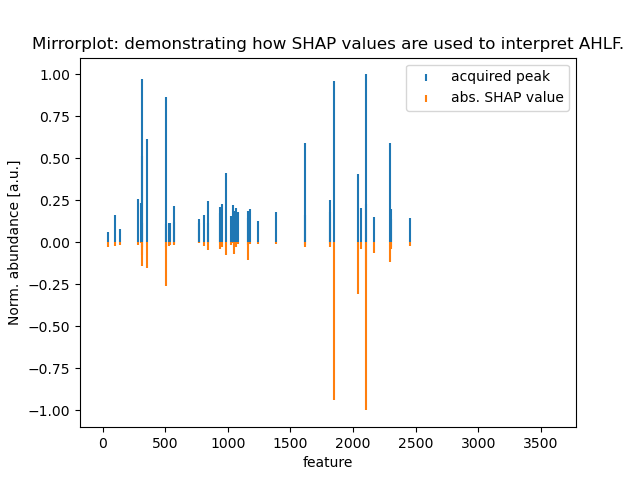

# AHLF - ad hoc learning of fragmentation patterns enabled by deep learning

Deep learning model (Temporal conv net, using dilated conv layers) detects post-translationally modified peptides based on their ms/ms spectrum.

This repository is an implementation of our model as described in:

***AHLF: ad hoc learning of peptide fragmentation from mass spectra enables an interpretable detection of phosphorylated and cross-linked peptides***
Tom Altenburg, Sven Giese, Shengbo Wang, Thilo Muth, Bernhard Y. Renard  
bioRxiv 2020.05.19.101345; doi: https://doi.org/10.1101/2020.05.19.101345 

## Getting started

**System requirements:** 
- Linux (tested on Ubuntu 18.04),
- Conda installed (e.g. follow documentation at [conda.io](conda.io)),
- runs on both CPU and GPU machines. (However, for the optional interpretation code snippet having a GPU is essential).

Create a new conda environment (required packages are automatically installed when using **`ahlf_env.yml`**):

```
conda env create -f ahlf_env.yml
conda activate ahlf_env
```

## Input File

AHLF accepts mgf-files. The provided **`example/example.mgf`** contains tandem spectra from: 10 phosphorylated peptides and 10 unphosphorylated peptides (in this particular order). 
The example looks like this (initial ten lines):

```
BEGIN IONS
TITLE=controllerType=0 controllerNumber=1 scan=10823
PEPMASS=762.798400878906
RTINSECONDS=2914.18014
CHARGE=2+
SCANS=10823
123.1500854 1432.9295654297 
148.0610199 3782.2087402344 
168.7863617 1880.0770263672 
241.082016 5990.2944335938 
```

## Usage

You can use the model on the provided **`./example/example.mgf`** by using **`inference.py`**:

Select a trained model from the model-dir (e.g. **`alpha_model_weights.hdf5`**)

```
python inference.py --tsv ./model/alpha_model_weights.hdf5 ./example/example.mgf results.tsv
```

## Output File

the tsv-file contains the prediction score (column='score') and the predicted binary-labels (column='pred'):

```
        title   scan    score   pred
0       controllerType=0 controllerNumber=1 scan=10823  10823   0.98990786      1.0
1       controllerType=0 controllerNumber=1 scan=10943  10943   0.9966457       1.0
2       controllerType=0 controllerNumber=1 scan=12197  12197   0.9999311       1.0
3       controllerType=0 controllerNumber=1 scan=13176  13176   0.99998116      1.0
4       controllerType=0 controllerNumber=1 scan=13283  13283   1.0     1.0
5       controllerType=0 controllerNumber=1 scan=13395  13395   1.0     1.0
6       controllerType=0 controllerNumber=1 scan=13547  13547   0.844296        1.0
7       controllerType=0 controllerNumber=1 scan=13657  13657   0.94686997      1.0
8       controllerType=0 controllerNumber=1 scan=13778  13778   0.8619728       1.0
9       controllerType=0 controllerNumber=1 scan=14343  14343   0.9951794       1.0
10      controllerType=0 controllerNumber=1 scan=30370  30370   0.25745904      0.0
11      controllerType=0 controllerNumber=1 scan=30531  30531   0.024190009     0.0
12      controllerType=0 controllerNumber=1 scan=39105  39105   0.03308204      0.0
13      controllerType=0 controllerNumber=1 scan=52207  52207   0.083298594     0.0
14      controllerType=0 controllerNumber=1 scan=52282  52282   0.017626554     0.0
15      controllerType=0 controllerNumber=1 scan=52369  52369   0.057228595     0.0
16      controllerType=0 controllerNumber=1 scan=55208  55208   0.44605583      0.0
17      controllerType=0 controllerNumber=1 scan=56041  56041   0.0009965003    0.0
18      controllerType=0 controllerNumber=1 scan=77784  77784   0.27133223      0.0
19      controllerType=0 controllerNumber=1 scan=82582  82582   0.2898352       0.0
```

#### binary labels:
  - phosphorylated = 1.0 
  - unphosphorylated = 0.0


## Syntax
Check out the help-page:
```
python inference.py -h
```

```
usage: inference.py [-h] [--tsv] model_weights mgf_file out_file

Read spectra from an mgf-file and output a prediction score.

positional arguments:
  model_weights  trained model weights
  mgf_file       input filename: mgf-file containing ms/ms spectra.
  out_file       output filename

optional arguments:
  -h, --help     show this help message and exit
  --tsv          write a tsv-file
  ```

## Training

In order to train the model, e.g. on user-specific data, you can use **`training.py`**:

(the labels are taken from the filenames: **`./training/dummy.phos.mgf`** and **`./training/dummy.other.mgf`**):

Training parameters can be changed in the **`training.py`** script directly.

```
python training.py
```

## [OPTIONAL] Interpretation of AHLF
**IMPORTANT: this step requieres a GPU with latest drivers installed**

For interpretation additional packages need to be installed (specified in the **`ahlf_interpretation_env.yml'**), it is recommended to simply create a new dedicated conda environment:

```
conda env create -f ahlf_interpretation_env.yml
conda activate ahlf_interpretation_env
```

If the above mentioned requierments are met then the following command creates a mirrorplot similar to the one shown below:

```
python interpretation.py
```




## Author

Tom Altenburg (tzom)


